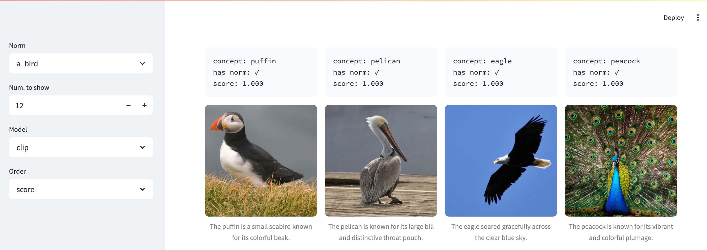

Brief intro to Streamlit for the LAMP group.
The slides are available [here](https://docs.google.com/presentation/d/1spVx8DgKaxioSHLlHTYB0zUIxmzfwtTUk02jzf0Fh0w/edit?usp=sharing).

The code is a toy of example of [this app](https://probing-norms-demo.streamlit.app/).
The can be run by running the following command.

```bash
streamlit run main.py
```

The output looks like this:


